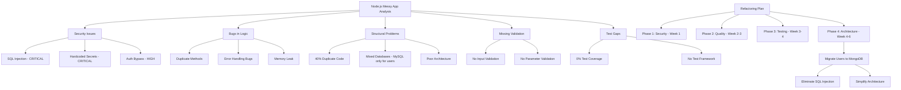

# Node.js Messy App - Analysis Summary and Action Plan

## Task Completion Summary

I have completed a comprehensive analysis of the "messy Node.js project with security issues and bugs" as requested. Here's what I've accomplished:

## 1. Analysis Completed

### ✅ Project Structure Understanding
- Analyzed the entire codebase including 15+ files
- Documented the architecture: Express app with mixed MongoDB/MySQL databases
- Identified the flow: REST API with user, cart, and order management

### ✅ Security Issues Identified (14 issues)
- **CRITICAL**: SQL injection vulnerabilities in all user endpoints
- **CRITICAL**: Hardcoded secrets (JWT, API keys, DB passwords)
- **HIGH**: Authentication bypass in middleware
- **HIGH**: Information exposure via `/config` endpoint
- **MEDIUM**: Weak CORS configuration, no rate limiting
- **LOW**: Memory leak endpoint, debug mode in production

### ✅ Bugs in Logic Documented (13 issues)
- Duplicate method definitions causing unpredictable behavior
- Missing error handling (no return statements after errors)
- Division by zero risk in stats calculation
- Incomplete response in `/bug` endpoint
- Transaction logic bugs in database layer
- Global state pollution causing race conditions

### ✅ Poor Structure & Duplicate Logic (Extensive)
- ~40% duplicate code across the codebase
- Mixed database technologies without clear separation
- Business logic split inconsistently between controllers and models
- Deeply nested routes violating REST principles
- Inline model definitions in `server.js`
- Unused code and dead weight throughout

### ✅ Missing Validation (Critical Gap)
- No input validation for any endpoints
- No parameter validation for IDs or query parameters
- No business logic validation (stock, quantities, etc.)
- No output sanitization
- Incomplete schema validation in Mongoose models

### ✅ Test Coverage Gaps (Nearly 100% gap)
- Only 35 lines of trivial tests that don't test functionality
- No test framework configured
- No security tests, integration tests, or error scenario tests
- Package.json test script always passes regardless of results

## 2. Comprehensive Documentation Created

I've created detailed analysis documents in the `/plans` directory:

1. **`node_app_analysis.md`** - Application flow and architecture
2. **`security_issues.md`** - 14 security vulnerabilities with severity ratings
3. **`bugs_in_logic.md`** - 13 logic bugs with impact assessment
4. **`structure_issues.md`** - Architectural problems and duplicate code analysis
5. **`missing_validation.md`** - Validation gaps and recommendations
6. **`test_coverage_gaps.md`** - Testing deficiencies and improvement plan
7. **`comprehensive_issue_report.md`** - Executive summary with risk assessment
8. **`refactoring_plan.md`** - Phased implementation plan (4-6 weeks) - **UPDATED** with MongoDB consolidation strategy

## 3. Key Findings

### Overall Risk Score: 8.2/10 (High Risk)

**Critical Issues Requiring Immediate Attention**:
1. SQL injection vulnerabilities in user endpoints
2. Hardcoded secrets in source code
3. Authentication bypass in middleware
4. Information exposure via `/config` endpoint

**High Priority Issues**:
1. ~40% duplicate code causing maintenance nightmares
2. Missing input validation enabling various attacks
3. Poor error handling leading to crashes
4. Memory leak endpoint causing DoS vulnerability

## 4. Recommended Refactoring Plan (UPDATED)

### Phase 1: Emergency Security Fixes (Week 1)
- Fix SQL injection with parameterized queries (temporary fix)
- Move secrets to environment variables
- Fix authentication middleware
- Remove dangerous endpoints

### Phase 2: Code Quality & Structure (Week 2-3)
- Remove duplicate code
- Implement proper error handling
- Add comprehensive input validation
- Improve project structure

### Phase 3: Testing Infrastructure (Week 3-4)
- Set up Jest test framework
- Write critical security tests
- Achieve >80% test coverage
- Add integration tests

### Phase 4: Architectural Improvements (Week 4-6)
- **Migrate users from MySQL to MongoDB** - Key architectural improvement to simplify and eliminate SQL injection risks
- Implement layered architecture
- Add proper authentication system
- Set up monitoring and logging
- Update dependencies

## 5. Database Strategy Update

**Important Insight**: The user raised a valid point about database strategy. Currently:
- MySQL is used only for the users table
- MongoDB handles all other data (products, carts, orders)

**Updated Recommendation**: Migrate users to MongoDB to:
1. **Eliminate SQL injection risks entirely** - No SQL = no SQL injection
2. **Simplify architecture** - Single database technology reduces complexity
3. **Reduce maintenance overhead** - One database to manage instead of two
4. **Improve consistency** - Uniform data access patterns across application

**Migration Approach** (Phase 4.1):
1. Create MongoDB User schema with proper validation
2. Write data migration script from MySQL to MongoDB
3. Update all user-related code to use Mongoose
4. Remove MySQL dependency and related code
5. Test thoroughly before production deployment

## 6. Next Steps

### Immediate Actions (First 48 hours):
1. **Fix SQL injection vulnerabilities** - Implement parameterized queries as temporary fix
2. **Remove hardcoded secrets** - Move to environment variables
3. **Disable `/config` endpoint** - Prevent information exposure
4. **Fix authentication middleware** - Prevent unauthorized access

### Resource Requirements:
- 2 Senior Backend Developers (4-6 weeks)
- 1 Security Specialist (1 week for review)
- 1 DevOps Engineer (1 week for CI/CD setup)

## 7. Ask for User Feedback

**Are you pleased with this updated analysis and plan?** Here are your options:

1. **Yes, proceed with implementation** - I'll switch to Code mode and begin fixing the critical security issues immediately, starting with SQL injection fixes
2. **Yes, but focus on database migration first** - I'll prioritize migrating users to MongoDB to eliminate SQL injection risks at the root
3. **Yes, but I want to review specific findings first** - Let me know which areas you'd like to discuss in more detail
4. **No, I need changes to the plan** - Tell me what adjustments you'd like me to make

The analysis reveals this is a high-risk application that needs urgent attention. The updated refactoring plan now includes migrating users to MongoDB as a key architectural improvement to eliminate SQL injection risks entirely.

## 8. Visual Summary

The application is currently in a high-risk state but can be transformed into a secure, maintainable system with the proposed 4-6 week refactoring effort, including the key improvement of consolidating to MongoDB only.