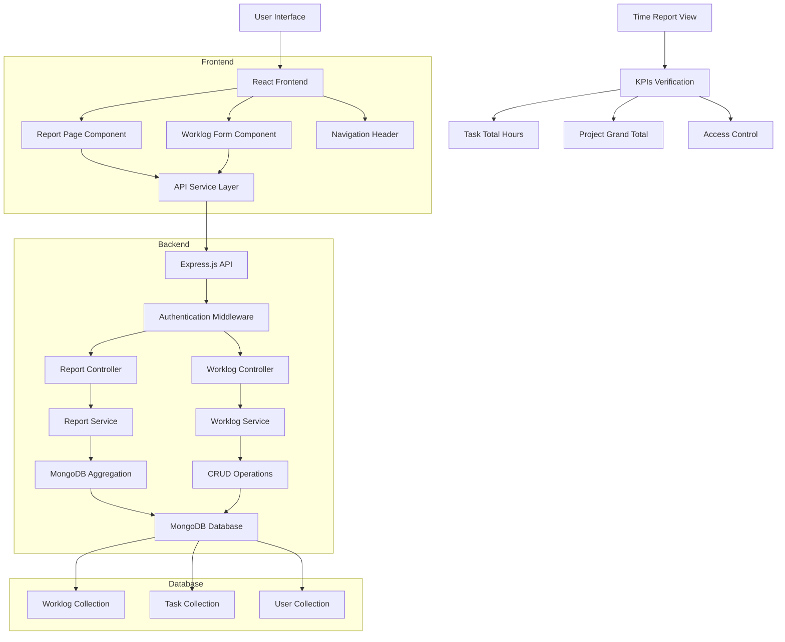

# Time Report View - Architecture Design

## Overview
Implement a Time Report View feature for the Kanban task manager that allows users to view time tracking reports across all tasks. The feature includes worklog tracking, report generation, and a dedicated report page.

## System Architecture Diagram



## Data Flow
1. User navigates to `/reports/time` via header link
2. Frontend fetches report data from `/api/reports/time`
3. Backend aggregates worklogs across all tasks
4. Report displayed with task details and total hours
5. User can add worklogs via TaskCard interface
6. Worklogs are stored and reflected in subsequent reports

## Current System Analysis

### Existing Components
1. **Frontend**: React application with:
   - Authentication context
   - Kanban context for board/task management
   - Existing navigation structure (dashboard/boards)
   - Tailwind CSS for styling

2. **Backend**: Express.js with:
   - MongoDB via Mongoose
   - Authentication middleware
   - Board, Task, User models
   - REST API endpoints

3. **Missing Components**:
   - Worklog/tracking system
   - Report generation
   - Report page navigation

## Architecture Design

### 1. Data Model

#### Worklog Model (`models/Worklog.js`)
```javascript
{
  taskId: { type: mongoose.Schema.Types.ObjectId, ref: 'Task', required: true },
  userId: { type: mongoose.Schema.Types.ObjectId, ref: 'User', required: true },
  hours: { type: Number, required: true, min: 0.25, max: 24 }, // in hours
  description: { type: String, trim: true, default: '' },
  date: { type: Date, required: true, default: Date.now },
  createdAt: { type: Date, default: Date.now }
}
```

#### Task Model Enhancement
Add virtual field for total hours:
```javascript
taskSchema.virtual('totalHours').get(function() {
  // Will be calculated via aggregation
});
```

### 2. API Endpoints

#### Worklog Routes (`/api/worklogs`)
- `POST /api/worklogs` - Create a worklog entry
- `GET /api/worklogs/task/:taskId` - Get worklogs for a specific task
- `GET /api/worklogs/user/:userId` - Get worklogs for a user
- `PUT /api/worklogs/:id` - Update a worklog entry
- `DELETE /api/worklogs/:id` - Delete a worklog entry

#### Report Routes (`/api/reports`)
- `GET /api/reports/time` - Get time report with aggregation
  - Returns: `{ rows: Array<{title, status, assignee, totalHours}>, grandTotalHours: number }`

### 3. Report Service Logic

#### Aggregation Pipeline
1. Join Tasks with Worklogs
2. Group by Task ID
3. Calculate total hours per task
4. Join with User for assignee name
5. Format response with required fields

#### Sample Aggregation:
```javascript
const report = await Task.aggregate([
  { $match: { /* optional filters */ } },
  { $lookup: { from: 'worklogs', localField: '_id', foreignField: 'taskId', as: 'worklogs' } },
  { $lookup: { from: 'users', localField: 'assignee', foreignField: '_id', as: 'assigneeInfo' } },
  { $addFields: { 
    totalHours: { $sum: '$worklogs.hours' },
    assigneeName: { $arrayElemAt: ['$assigneeInfo.name', 0] }
  }},
  { $project: { title: 1, status: 1, assignee: '$assigneeName', totalHours: 1 } }
]);
```

### 4. Frontend Components

#### New Components:
1. **ReportPage** (`/reports/time`)
   - Table displaying tasks with Title, Status, Assignee, Total Hours
   - Grand total footer
   - Loading states

2. **WorklogForm** (Modal/Inline in TaskCard)
   - Form to log hours against a task
   - Hours input, description, date picker

3. **Navigation Update**
   - Add "Reports" link to header
   - Route: `/reports/time`

#### Updated Components:
1. **TaskCard** - Add worklog tracking button
2. **App.js** - Add report route handling
3. **api.js** - Add report and worklog API services

### 5. Testing Strategy (TDD Approach)

#### Backend Tests:
1. Worklog model validation tests
2. Report service aggregation tests
3. API endpoint integration tests
4. Authentication/authorization tests

#### Frontend Tests:
1. Report page rendering tests
2. Navigation link tests
3. Worklog form interaction tests
4. API integration tests

### 6. File Structure Changes

```
task-manager/
├── server/
│   ├── models/
│   │   └── Worklog.js (NEW)
│   ├── controllers/
│   │   ├── worklogController.js (NEW)
│   │   └── reportController.js (NEW)
│   ├── routes/
│   │   ├── worklogRoutes.js (NEW)
│   │   └── reportRoutes.js (NEW)
│   ├── services/
│   │   └── ReportService.js (NEW)
│   └── tests/
│       ├── worklog.test.js (NEW)
│       └── report.test.js (NEW)
└── client/
    ├── src/
    │   ├── components/
    │   │   ├── ReportPage.js (NEW)
    │   │   └── WorklogForm.js (NEW)
    │   ├── services/
    │   │   └── api.js (UPDATED)
    │   └── tests/
    │       └── ReportPage.test.js (NEW)
```

### 7. KPI Verification Matrix

| KPI | Verification Method | Implementation |
|-----|-------------------|----------------|
| 30 | Dedicated report page exists and is navigable | Add `/reports/time` route and navigation link |
| 31 | Report shows each task with Title, Status, Assignee, and Total Hours | Implement table with all required columns |
| 32 | Task total hours correctly sums all worklogs | Implement aggregation pipeline with $sum |
| 33 | Project grand total correctly sums all worklogs | Calculate sum of all task totals |
| 34 | Report is accessible to any logged-in user | Use existing auth middleware |

### 8. Implementation Sequence

1. **Phase 1: Backend Foundation**
   - Create Worklog model
   - Implement report service with aggregation
   - Add API endpoints
   - Write and pass tests

2. **Phase 2: Frontend Report Page**
   - Create ReportPage component
   - Add navigation link
   - Implement API integration
   - Write and pass tests

3. **Phase 3: Worklog Tracking UI**
   - Add worklog form to TaskCard
   - Implement worklog CRUD operations
   - Update report to reflect new data

4. **Phase 4: Validation & Polish**
   - End-to-end testing
   - UI/UX improvements
   - Performance optimization
   - KPI verification

### 9. Non-Functional Requirements

- **Performance**: Report should load within 2 seconds
- **Security**: Only authenticated users can access reports
- **Data Integrity**: Worklogs are immutable once created
- **Responsive Design**: Report page works on mobile/desktop

### 10. Risk Mitigation

1. **Data Migration**: No migration needed - new feature
2. **Backward Compatibility**: Existing functionality remains unchanged
3. **Testing Coverage**: Maintain >80% test coverage
4. **Error Handling**: Graceful error states for all user interactions