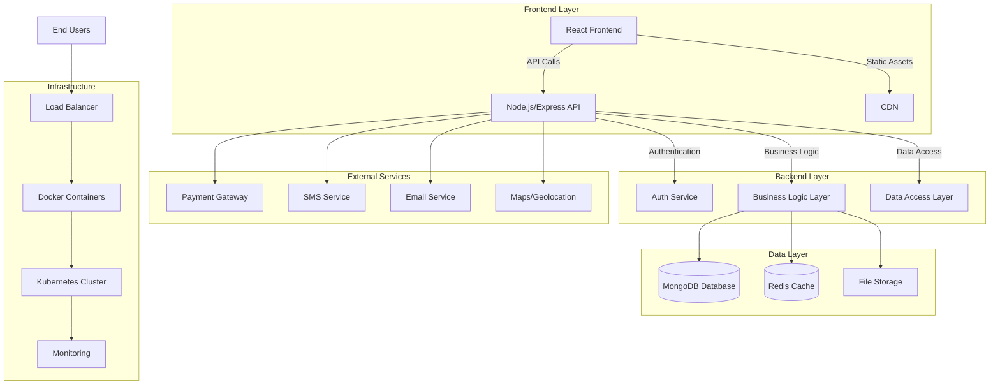

# The Rentals - Bike and Car Rental Service
## High-Level Design (HLD) Documentation

### 1. Project Overview
**The Rentals** is a SaaS platform for bike and car rentals with hourly pricing, coupon system, and multi-city expansion strategy. Initial focus on Mumbai with plans to expand to other major Indian cities.

### 2. Business Requirements
- **Vehicle Types**: Bikes and cars
- **Pricing Model**: Hourly rates with dynamic pricing
- **Features**: Coupon/discount system, user authentication, booking management, payment integration, admin dashboard
- **Geography**: Mumbai-first approach, scalable to other cities
- **Target Users**: End customers (renters), vehicle owners (providers), administrators

### 3. System Architecture - High-Level Design

### 4. Core Components

#### 4.1 Frontend (React)
- **User Portal**: Vehicle browsing, booking, payment, profile management
- **Admin Dashboard**: Vehicle management, user management, analytics, coupon management
- **Owner Portal**: Vehicle listing, earnings tracking, availability management

#### 4.2 Backend (Node.js/Express)
- **API Gateway**: Routes requests to appropriate services
- **Authentication Service**: JWT-based auth, role-based access control
- **Booking Service**: Manages reservations, availability, pricing
- **Payment Service**: Handles transactions, refunds, payment gateway integration
- **Vehicle Service**: Manages vehicle inventory, categories, pricing rules
- **Coupon Service**: Discount codes, validation, usage tracking
- **Notification Service**: Email, SMS, push notifications

#### 4.3 Database (MongoDB)
- **Users Collection**: Customer profiles, authentication data
- **Vehicles Collection**: Bike/car details, specifications, pricing
- **Bookings Collection**: Reservation records, status, timestamps
- **Payments Collection**: Transaction history, refunds
- **Coupons Collection**: Discount codes, validity, usage limits
- **Locations Collection**: City data, pickup/drop points

### 5. Technology Stack

#### 5.1 Frontend
- **Framework**: React.js with TypeScript
- **State Management**: Redux Toolkit / Context API
- **UI Library**: Material-UI / Ant Design
- **Routing**: React Router v6
- **Forms**: Formik + Yup validation
- **Maps Integration**: Google Maps API / Mapbox

#### 5.2 Backend
- **Runtime**: Node.js
- **Framework**: Express.js
- **Authentication**: JWT, bcrypt for password hashing
- **Validation**: Joi / Zod
- **File Upload**: Multer
- **Caching**: Redis
- **Queue**: Bull (for background jobs)

#### 5.3 Database
- **Primary**: MongoDB Atlas (cloud)
- **ODM**: Mongoose
- **Caching**: Redis for session and frequent queries

#### 5.4 DevOps & Infrastructure
- **Containerization**: Docker
- **Orchestration**: Kubernetes / Docker Compose (dev)
- **CI/CD**: GitHub Actions / Jenkins
- **Monitoring**: Prometheus + Grafana
- **Logging**: ELK Stack (Elasticsearch, Logstash, Kibana)

### 6. Key Features Implementation

#### 6.1 Hourly Rate System
- Dynamic pricing based on time, vehicle type, demand
- Peak hour pricing multipliers
- Minimum booking duration (e.g., 2 hours)
- Extension handling with pro-rata charges

#### 6.2 Coupon System
- Percentage-based and fixed-amount discounts
- Usage limits (per user, total usage)
- Validity periods (date range)
- Vehicle category restrictions
- First-time user coupons

#### 6.3 Multi-City Architecture
- City-specific vehicle inventory
- Location-based pricing
- Pickup/drop location management
- Expansion-ready database design

### 7. Scalability Considerations
- **Horizontal Scaling**: Stateless API servers behind load balancer
- **Database Sharding**: By city for vehicle and booking data
- **Caching Strategy**: Redis for frequently accessed data
- **CDN**: For static assets and images
- **Microservices Readiness**: Component-based design for future decomposition

### 8. Security Measures
- **Authentication**: JWT with refresh tokens
- **Authorization**: Role-based access control (Customer, Owner, Admin)
- **Data Encryption**: TLS/SSL, encrypted sensitive data at rest
- **Payment Security**: PCI-DSS compliance via payment gateway
- **Rate Limiting**: API request throttling
- **Input Validation**: Sanitization and validation at all layers

### 9. Deployment Strategy
- **Development**: Docker Compose for local environment
- **Staging**: Kubernetes cluster with limited resources
- **Production**: Cloud Kubernetes (AWS EKS / Google GKE) with auto-scaling
- **Database**: MongoDB Atlas managed service
- **Monitoring**: CloudWatch / Stackdriver for metrics

### 10. Future Expansion
- **Additional Vehicle Types**: Scooters, electric vehicles, luxury cars
- **Subscription Plans**: Monthly/annual membership
- **Mobile Apps**: React Native for iOS/Android
- **IoT Integration**: Smart locks, vehicle tracking
- **AI/ML**: Demand prediction, dynamic pricing optimization