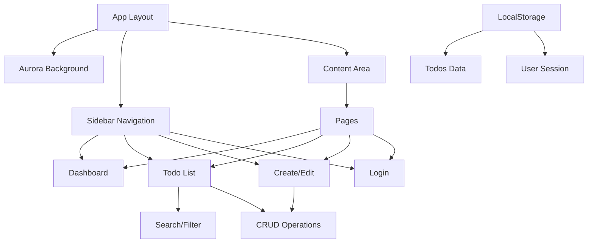

# Todo Dashboard (SaaS UI) - Implementation Plan

## Project Overview
Build a modern Todo Dashboard with React + TypeScript + Tailwind, featuring:
- Aurora WebGL background (from bg-design.md)
- Sidebar + content layout
- LocalStorage persistence
- Mock authentication
- CRUD operations with search/filter

## Architecture



## File Structure
```
app/
├── layout.tsx (updated with Aurora + Sidebar)
├── page.tsx (Dashboard home)
├── components/
│   ├── Aurora/
│   │   ├── Aurora.tsx (WebGL background)
│   │   └── Aurora.css
│   ├── Sidebar/
│   │   ├── Sidebar.tsx
│   │   └── NavItem.tsx
│   ├── Todo/
│   │   ├── TodoList.tsx
│   │   ├── TodoItem.tsx
│   │   ├── TodoForm.tsx
│   │   └── TodoStats.tsx
│   └── UI/
│       ├── Button.tsx
│       ├── Card.tsx
│       └── Modal.tsx
├── lib/
│   ├── types.ts (Todo, User types)
│   ├── storage.ts (localStorage utilities)
│   └── utils.ts (helpers)
├── pages/
│   ├── dashboard/
│   │   └── page.tsx
│   ├── todos/
│   │   └── page.tsx
│   ├── login/
│   │   └── page.tsx
│   └── layout.tsx (shared page layout)
└── styles/
    └── globals.css (updated Tailwind)
```

## Implementation Steps

### 1. Dependencies Installation
- Install `ogl` for Aurora WebGL background
- No additional UI libraries (use Tailwind components)

### 2. Core Types & Storage
- Define TypeScript interfaces for Todo and User
- Create localStorage wrapper with CRUD operations
- Implement mock authentication state

### 3. Aurora Background Component
- Copy implementation from bg-design.md
- Integrate as app background
- Ensure performance optimization

### 4. Layout Components
- Sidebar with navigation items
- Responsive layout (collapsible on mobile)
- Content area with Aurora background

### 5. Pages Implementation
- **Login Page**: Mock authentication form
- **Dashboard**: Statistics cards (total todos, completed, pending, overdue)
- **Todo List**: Table/list view with search, filter by status/priority
- **Create/Edit**: Modal form with validation

### 6. Features
- CRUD operations with immediate localStorage sync
- Status toggle (complete/incomplete)
- Priority levels (Low, Medium, High)
- Due date with calendar picker
- Search by title/description
- Filter by status, priority, date range

### 7. Styling & UX
- SaaS-style design (clean, modern, professional)
- Tailwind utility classes
- Responsive breakpoints
- Loading states
- Error handling

### 8. Testing & Polish
- Test all CRUD operations
- Verify localStorage persistence
- Check responsive behavior
- Update metadata (title, favicon)

## Technical Considerations
- **Performance**: Aurora WebGL runs in background, optimize re-renders
- **State Management**: React state + localStorage sync
- **Type Safety**: Full TypeScript coverage
- **Responsive**: Mobile-first approach
- **Accessibility**: Semantic HTML, ARIA labels

## Success Criteria
- [ ] Aurora background renders correctly
- [ ] Sidebar navigation works
- [ ] Todos persist across page reloads
- [ ] All CRUD operations functional
- [ ] Search/filter works
- [ ] Responsive on mobile/desktop
- [ ] Clean, modern SaaS aesthetic